# Multithreading

Takeaways:

* Performance can be achieved by parallelizing tasks.
* **Native:** Tasks submitted to the thread pool are executed immediately\[citation needed\].
* **WASM:** Tasks submitted to the thread pool are [executed when control returns to the browser].
* **WASM:** Since tasks will never run until the main thread returns, the main thread cannot wait for tasks to complete.
* Github issue(s): [amethyst#2191]

Amethyst uses `rayon` to manage a thread pool, and parallel processing is achieved by submitting tasks to that pool.

```dot process Dispatcher
digraph Dispatcher {
    fontcolor = "#7f7f7f";
    label = <<B>Game Logic</B>>;

    graph [
        fontname = "Arial",
        fontsize = 15,
        labelloc = top,
        bgcolor = "transparent",
        nodesep = 0.1,
        ranksep = 0,
    ];

    compound = true
    ranksep = 0.5
    node [
        fillcolor = "#bbddff",
        fontname = "consolas, ubuntu mono",
        fontsize = 12,
        width = 1.4,
        shape = box,
        style = "rounded, filled",
    ];

    edge [color = "#7f7f7f"];

    subgraph cluster_systems {
        label = <<B>Parallelisable</B>>;
        fontsize = 13;
        penwidth = 2.0;
        color = "#99aaff";
        style = "dashed, rounded";

        asset_load [
            label = <<table border="0" cellborder="0">
                <tr>
                    <td align="left"><b><font color="#af00af">&nbsp;</font></b></td>
                    <td align="left">📦</td>
                    <td align="left"><b>Load<br/>Assets</b></td>
                </tr>
            </table>>,
        ];

        file_read [
            label = <<table border="0" cellborder="0">
                <tr>
                    <td align="left"><b><font color="#af00af">&nbsp;</font></b></td>
                    <td align="left">📄</td>
                    <td align="left"><b>Read<br/>File</b></td>
                </tr>
            </table>>,
        ];

        music [
            label = <<table border="0" cellborder="0">
                <tr>
                    <td align="left"><b><font color="#af00af">W2</font></b></td>
                    <td align="left">🎶</td>
                    <td align="left"><b>Play<br/>Music</b></td>
                </tr>
            </table>>,
        ];

        network_events [
            label = <<table border="0" cellborder="0">
                <tr>
                    <td align="left"><b><font color="#af00af">W1</font></b></td>
                    <td align="left">🌐</td>
                    <td align="left"><b>Network</b></td>
                </tr>
            </table>>,
        ];

        device_events [
            label = <<table border="0" cellborder="0">
                <tr>
                    <td align="left"><b><font color="#af00af">W0</font></b></td>
                    <td align="left">🎮</td>
                    <td align="left"><b>Device</b></td>
                </tr>
            </table>>,
        ];

        position [
            label = <<table border="0" cellborder="0">
                <tr>
                    <td align="left"><b><font color="#af00af">&nbsp;</font></b></td>
                    <td align="left">📡</td>
                    <td align="left"><b>Position</b></td>
                </tr>
            </table>>,
        ];

        device_events -> position;
        network_events -> position;

        invis_2 [label = "", style = "invis"];
        file_read -> invis_2 [style = "invis"];
    }

    subgraph cluster_thread_local {
        label = <<B>Thread Local</B>>;
        fontsize = 13;
        penwidth = 2.0;
        color = "#cc99dd";
        style = "dashed, rounded";

        node [fillcolor = "#ddccff"]

        render [
            label = <<table border="0" cellborder="0">
                <tr>
                    <td align="left"><b><font color="#af00af">main</font></b></td>
                    <td align="left">🖌️</td>
                    <td align="left"><b>Render<br/></b></td>
                </tr>
            </table>>,
        ];

        load_textures [
            label = <<table border="0" cellborder="0">
                <tr>
                    <td align="left"><b><font color="#af00af">&nbsp;</font></b></td>
                    <td align="left">🎨</td>
                    <td align="left"><b>Load<br/>Textures</b></td>
                </tr>
            </table>>,
        ]

        position -> load_textures [style = "invis"];
    }

    thread_pool [
        label = <<table border="0" cellborder="0">
            <tr><td colspan="2"><b>Thread Pool</b></td></tr>
            <tr><td style="radial">W0</td><td style="radial">W1</td></tr>
            <tr><td style="radial">W2</td><td style="radial">...</td></tr>
        </table>>,
        fillcolor = "#6688ff",
        width = 1.5,
        shape = "circle",
    ];

    invis_2 -> thread_pool [style = "invis"];
}
```

Dispatcher

## Native

In native applications, parallel execution is enabled by default.

When tasks are submitted to the thread pool, they are executed immediately.

Parallel execution control flow

<!-- Hide placeholder node -->

&nbsp; <!-- Needed to get the diagram to show up within the details block -->

```mermaid
sequenceDiagram
    participant main
    participant #nbsp;
    participant W0
    participant W1
    participant W2

    main ->>+ #nbsp;: dispatch_par()

    rect rgba(0, 100, 255, .2)
        #nbsp; -->>+ W2: 🎶 Play Music#nbsp;#nbsp;#nbsp;#nbsp;#nbsp;#nbsp;#nbsp;#nbsp;#nbsp;#nbsp;#nbsp;#nbsp;#nbsp;#nbsp;#nbsp;#nbsp;#nbsp;#nbsp;#nbsp;#nbsp;#nbsp;#nbsp;#nbsp;#nbsp;#nbsp;#nbsp;#nbsp;#nbsp;#nbsp;#nbsp;#nbsp;#nbsp;#nbsp;#nbsp;#nbsp;#nbsp;#nbsp;#nbsp;#nbsp;#nbsp;

        #nbsp; -->>+ W0: 🎮 Device#nbsp;#nbsp;#nbsp;#nbsp;
        #nbsp; -->>+ W1: 🌐 Network #nbsp;#nbsp;#nbsp;#nbsp;#nbsp;#nbsp;#nbsp;#nbsp;#nbsp;#nbsp;#nbsp;#nbsp;#nbsp;#nbsp;#nbsp;#nbsp;#nbsp;#nbsp;#nbsp;#nbsp;#nbsp;#nbsp;

        W0 -->>- #nbsp;: #nbsp;
        W1 -->>- #nbsp;: #nbsp;

        W2 -->>- #nbsp;: #nbsp;

        #nbsp; -->>+ W2: 📦 Load Assets#nbsp;#nbsp;#nbsp;#nbsp;#nbsp;#nbsp;#nbsp;#nbsp;#nbsp;#nbsp;#nbsp;#nbsp;#nbsp;#nbsp;#nbsp;#nbsp;#nbsp;#nbsp;#nbsp;#nbsp;#nbsp;#nbsp;#nbsp;#nbsp;#nbsp;#nbsp;#nbsp;#nbsp;#nbsp;#nbsp;#nbsp;#nbsp;#nbsp;#nbsp;#nbsp;#nbsp;#nbsp;#nbsp;#nbsp;#nbsp;
        Note left of W2: 📦 Task

        #nbsp; -->>+ W1: 📄 Read File#nbsp;#nbsp;#nbsp;#nbsp;#nbsp;#nbsp;#nbsp;#nbsp;#nbsp;#nbsp;#nbsp;#nbsp;#nbsp;#nbsp;#nbsp;#nbsp;#nbsp;#nbsp;#nbsp;#nbsp;#nbsp;#nbsp;

        W2 -->>- #nbsp;: #nbsp;
        W1 -->>- #nbsp;: #nbsp;

        #nbsp; -->>+ W0: 📡 Position#nbsp;#nbsp;#nbsp;
        W0 -->>- #nbsp;: #nbsp;

        W1 -->+ W1: 📦 Asset Load Task

    end

    #nbsp; ->>- main: #nbsp;


    %% Asset Load Task end
    W1 -->- W1: #nbsp;

    main ->>+ #nbsp;: dispatch_thread_local()

    rect rgba(180, 0, 220, .2)
        #nbsp; -->>+ main: 🖌️ Render
        main -->>- #nbsp;: #nbsp;
        #nbsp; -->>+ main: 🎨 Load Textures
        main -->>- #nbsp;: #nbsp;
    end

    #nbsp; ->>- main: #nbsp;
```

## WASM

When adding WASM support, sequential execution is used.

If we tried to use parallel execution, tasks that are submitted to the thread pool are queued. They will only run when control has been returned to the browser, as the browser will only send the tasks (as messages) to each web worker when it has control. This is a problem because the main thread would be waiting for all the tasks to complete, when in fact nothing is running.

Sequential execution control flow

<!-- Hide placeholder node -->

&nbsp; <!-- Needed to get the diagram to show up within the details block -->

[executed when control returns to the browser]: https://github.com/azriel91/worker_sync_xhr
[amethyst#2191]: https://github.com/amethyst/amethyst/issues/2191