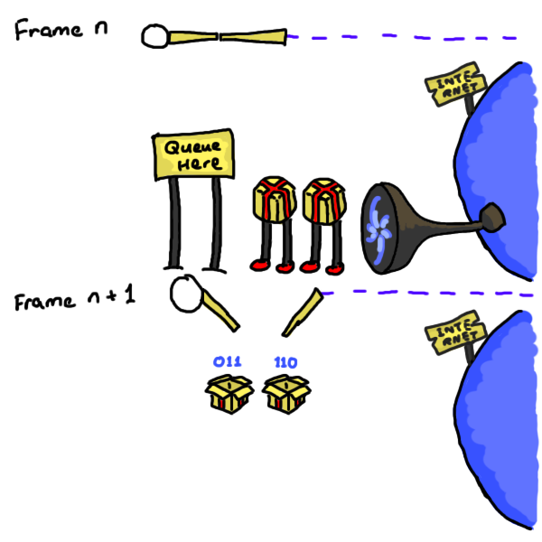

# Networking

Takeaways:

* **Native:** Arbitrary TCP, UDP connections can be made.
* **Native:** Can communicate using the [`WebSocket`] protocol.
* **WASM:** Need to obey browser security rules.
* **WASM:** Can communicate using [`WebSocket`]s.
* **WASM:** Receiving messages is done through callbacks, and requires a lot of wiring to pass the message back to Rust.
* Github issue(s): [amethyst#2251]

## Native

### Sending Messages

1. 🌐 You want to play online.
2. 🔌 You open a connection.
3. 📡 You send data.

### Receiving Messages

1. Check for messages received by the network socket.
2. Iterate and decide what to do with them.

<details open>
<summary>Example</summary>
<span style="display: block; margin-left: 20px;">



</span>
</details>

## WASM

**Note:** If you retain the TCP / UDP code, the WASM application doesn't crash, but simply logs that this part is not implemented.

### Sending Messages

1. 🌐 You want to play online.
2. 📨 You send the [`WebSocket`] and the message byte array (accessed through [`SharedArrayBuffer`]) to JS.

    ```rust,ignore
    #[wasm_bindgen]
    extern "C" {
        fn web_socket_send(web_socket: &WebSocket, src: &[u8]);
    }
    ```

3. 📋 You clone the data.
4. 💽 You send data to the web socket.

    ```js
    function web_socket_send(web_socket, src) {
        // Turn the array view into owned memory.
        var standalone = [...src];
        // Make it a Uint8Array.
        let bytes = new Uint8Array(standalone);

        web_socket.send(bytes);
    }
    ```

5. 📮 The message is sent when the main thread returns.

### Receiving Messages

1. When creating the web socket, set up an `onmessage` callback.
2. In the `onmessage` callback, use a [`FileReader`] to begin to read the bytes from the socket.
3. Also, set up an `onload` callback for when the `FileReader` has finished reading bytes.
4. In the `onload` callback, send the message through to Rust using a `channel`.
5. In Rust, read from the channel for any messages.

<details open>
<summary>Example</summary>
<span style="display: block; margin-left: 20px;">


</span>
</details>

[`SharedArrayBuffer`]: https://developer.mozilla.org/en-US/docs/Web/JavaScript/Reference/Global_Objects/SharedArrayBuffer
[`WebSocket`]: https://developer.mozilla.org/en-US/docs/Web/API/WebSockets_API
[amethyst#2251]: https://github.com/amethyst/amethyst/issues/2251
