# Rendering

Takeaways:

* The output variables of one shader are used as the input variables to the next shader.
* **Native:** The *types* of the variables passed from one shader to the next shader need to match.
* **WASM:** The *names and types* of the variables passed from one shader to the next shader need to match.
* Github issue(s): [amethyst#2192], [amethyst#2205], [amethyst#2247]

In Amethyst, rendering is done with a standard graphics pipeline. *Shaders* are little programs along the pipeline that transform data to be drawn on screen.

```dot process Graphics Pipeline
digraph graphics_pipeline {
    bgcolor = "transparent";
    rankdir = "LR";
    compound = true;
    ranksep = 0.1;
    node [
        color = "#5577aa",
        fillcolor = "#bbddff",
        fontname = "consolas, ubuntu mono",
        fontsize = 12,
        shape = box,
        style = "rounded, filled",
    ];

    pipeline [
        shape = "record",
        label = <{ <B>🖊️ Input</B> | <B>✂️ Vert</B> | <B>📐 Geom</B> | <B>🔗 Tess</B> | <B>🎨 Rast</B> | <B>🖍️ Frag</B> | <B>🖌️ Blend</B> }>,
    ];
}
```



A shader looks like this:

```c
#version 450

// some details removed

// input parameters
in vec2 var_in_0;
in vec2 var_in_1;

// output parameters
out vec2 var_0;
out vec4 var_1;

void main() {
    // code
}
```

## Native

The types of the output variables from one shader need to match the types of the input variables of the next shader:

* ✂️ Vertex shader

    ```c
    out vec2 tex_coords;
    out vec4 color;
    ```

* 🖍️ Fragment shader

    ```c
    // Variable types match up.
    in vec2 in_tex_coords;
    in vec4 in_color;
    ```

## WASM

The names and types of the output variables from one shader need to match the names and types of the input variables of the next shader:

* ✂️ Vertex shader

    ```c
    out vec2 vert_out_tex_coords;
    out vec4 vert_out_color;
    ```

* 🖍️ Fragment shader

    ```c
    // Variable names and types match up.
    in vec2 vert_out_tex_coords;
    in vec4 vert_out_color;
    ```

[amethyst#2192]: https://github.com/amethyst/amethyst/issues/2192
[amethyst#2205]: https://github.com/amethyst/amethyst/issues/2205
[amethyst#2247]: https://github.com/amethyst/amethyst/issues/2247
