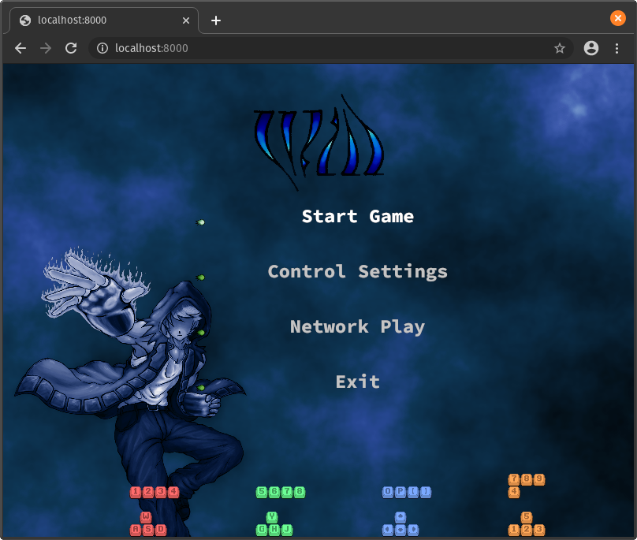

# Demo

**Left:** vision, **Right:** actual

[](will_browser_vision.png) [](will_browser.png)

It's very nice when something turns out to be how it was envisioned in the first place.

## Live

1. Run both native and web versions

    ```bash
    cd autexousious # https://github.com/azriel91/autexousious

    # native
    cargo run --bin will --release -- --session_server_address 127.0.0.1

    # web
    ./scripts/build_wasm.sh
    simple-http-server -i --nocache
    ```

2. For online play, run the session server:

    ```bash
    cargo run --bin session_server --release -- --address 127.0.0.1
    ```

3. Open <http://localhost:8000> in Chrome.

## Video

<div><iframe width="750" height="422" src="https://www.youtube.com/embed/Hc8EtqrlJsE" frameborder="0" allow="accelerometer; autoplay; encrypted-media; gyroscope; picture-in-picture" allowfullscreen></iframe></div>
