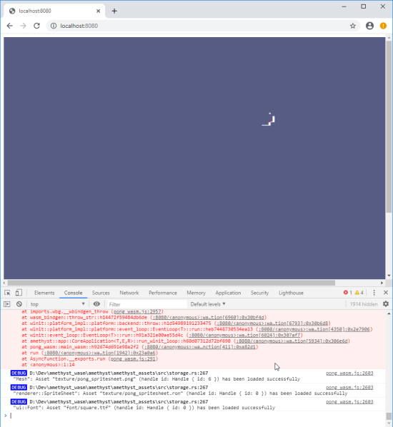
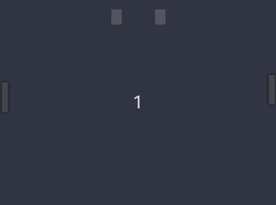
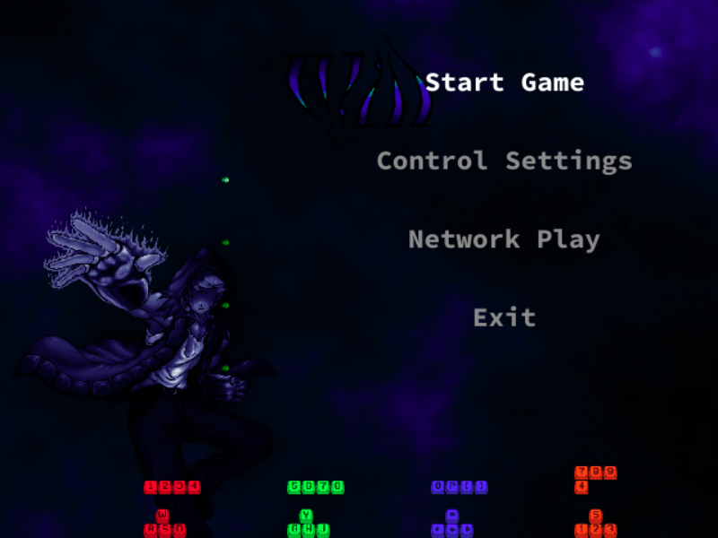

# Worth Mentioning

<details>
<summary>Track your progress with an end-to-end project.</summary>
<span style="display: block; margin-left: 20px;">

Having an end-to-end project that uses the project you are developing helps you discover and prioritize issues.

Initially we began with [Pong], then we became more ambitious:

<details open>
<summary><b>Week 1:</b> Compile</summary>
<span style="display: block; margin-left: 20px;">

```bash
$ wasm-pack build -- --features "wasm gl"
# ..
[INFO]: :-) Done in 37.87s
[INFO]: :-) Your wasm pkg is ready to publish at ./pkg.
```

</span>
</details>

<details open>
<summary><b>Week 2:</b> Runs 1 frame</summary>
<span style="display: block; margin-left: 20px;">



</span>
</details>

<details open>
<summary><b>Week 3:</b> It moves</summary>
<span style="display: block; margin-left: 20px;">



</span>
</details>

<details open>
<summary><b>Week 4:</b> Audio</summary>
<span style="display: block; margin-left: 20px;">

<video controls><source src="2020-04-09_pong_wasm_audio.mp4" /></video>

</span>
</details>


</span>
</details>

<details>
<summary>Forget what you know about programming for a moment.</summary>
<span style="display: block; margin-left: 20px; font-size: 1.5em;">

<a href="canvas_wrong_coordinates.png" target="_blank"></a>

In the following sequence `canvas.width()` is a getter. Where is `canvas.set_attribute("width", 640)` called?

1. A
2. `canvas.width()` -> 800
3. B
4. `canvas.width()` -> 800
5. C
6. `canvas.width()` -> 640
7. D


<details>
<summary>Answer</summary>
<span style="display: block; margin-left: 20px;">

B. See [amethyst#2247 (comment)]

1. `canvas.width()` -> 800
2. `canvas.set_attribute("width", 640);`
3. `canvas.width()` -> 800
4. Do who-knows-what with Gpu Device and contexts
5. `canvas.width()` -> 640

</span>
</details>

</span>
</details>

<details>
<summary>If you want help, create an environment where it is easy to help.</summary>
<span style="display: block; margin-left: 20px;">

Effort in the first week was solely to make it easy for people to see what issues are ready to be work on.

* The difficulty of nearly every issue was pretty high, but every week new issues were created.
* Really fortunate that [`@chemicstry`] wasn't phased by the level of difficulty, and got us through the multithreading issue.
* Within a day after posting two good [starter] [issues], they were fixed by someone new.

</span>
</details>

<details>
<summary>If you have the option to begin from scratch, choose that.</summary>
<span style="display: block; margin-left: 20px;">

Retrofitting browser WASM support &ndash; asynchronous event handling model &ndash; to an existing application that is designed for synchronous execution is somewhat messy.

</span>
</details>

<details>
<summary>There is also a development focused project report.</summary>
<span style="display: block; margin-left: 20px;">

Online at <https://amethyst.github.io/wasm_rush_report/>.

This covers:

* How the project was managed.
* Project implementation time line.
* Links to forks, issues, and PRs that made it back to upstream repositories.
* Future work.

</span>
</details>

[`@chemicstry`]: https://github.com/chemicstry
[amethyst#2247 (comment)]: https://github.com/amethyst/amethyst/issues/2247#issuecomment-616800595
[issues]: https://github.com/amethyst/amethyst/issues/2216
[Pong]: https://github.com/amethyst/pong_wasm
[starter]: https://github.com/amethyst/amethyst/issues/2215
